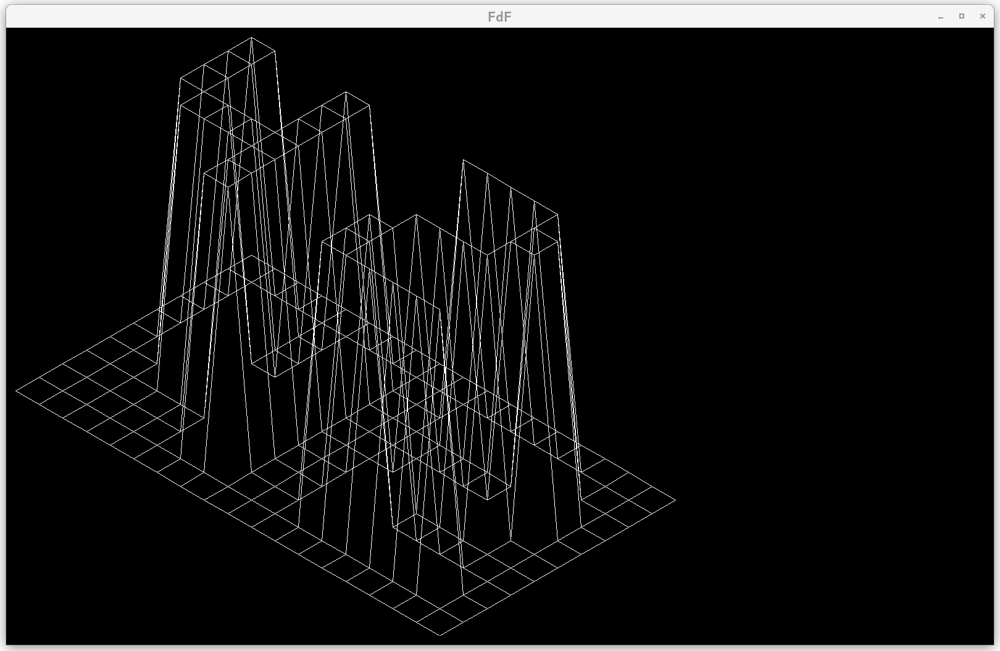

# Fil de fer
Create a wireframe projection from a heightmap

## Description
Parses height values from a text file with `.fdf` ending and renders the plane as a wireframe, connectin each point to adjacent ones. Each point can include a RGBA color value in hexadecimal. This will be used to color the point, lines connecting the points will be drawn with a gradient, calculated from their respective color values. 

## Installation
Clone this repository and then run: 

    make

The makefile will clone MLX42 from [here](https://github.com/codam-coding-college/MLX42) and build the executable. 

## Usage

Run the program with a map file:

    ./fdf ./test_maps/42.fdf

Test maps are included in the `test_maps` folder. 

